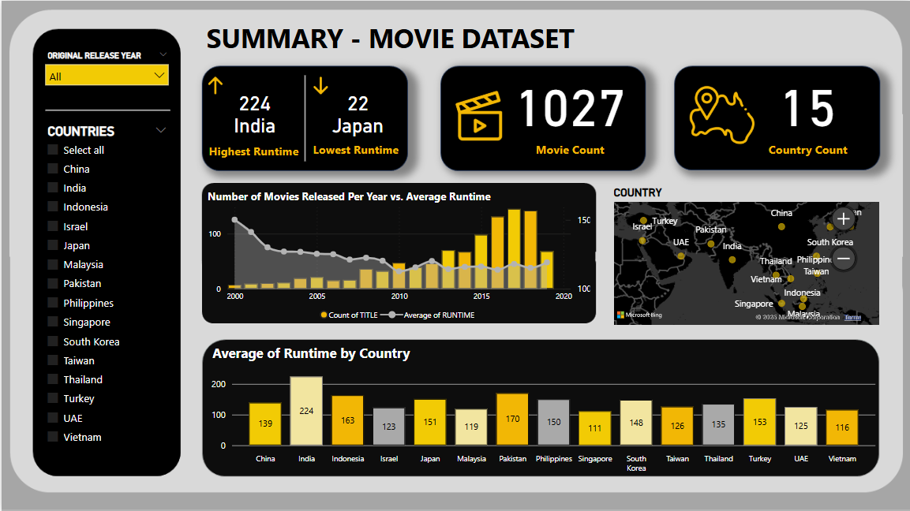

# Netflix Global Content Analysis

  
   
  

---

This Power BI project was created as a requirement for Cavite State University - Imus.

The dashboard analyzes Netflix's global content, providing insights into trends, genres, and regional availability using Power BI visualizations.

---

## 📊 Dashboard Description

The dashboard offers a visual exploration of Netflix's worldwide content library. It highlights the distribution of movies and TV shows by country, popular genres, and content trends over time. The two UI versions showcase different design approaches: one with a modern interface, and another with a yellow/black theme to match a partner presentation.

### What You See
- Geographic breakdown of Netflix content availability
- Most popular genres and their distribution
- Trends in content release years and growth
- Visual comparisons between different countries and regions

These dashboards help users understand Netflix's global strategy and content diversity at a glance.
